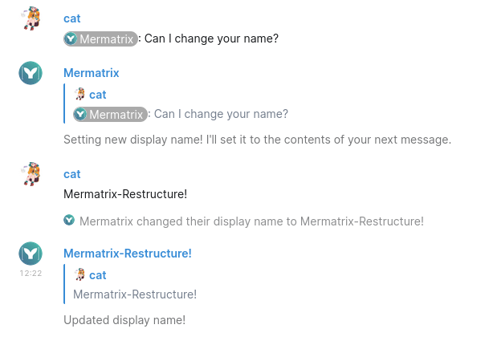

# Mermatrix


<span>

<br>

Mermaid.js doesn't render automatically in Matrix. Lets fix that!
When a message contains a mermaid code block, this bot will return that very diagram.
</span>



Functionality:
- On a new message containing a diagram definition, render the diagram(s).
- Render multiple diagrams from one message.
- When the original message gets edited in x amount of time, re-render.
- Choose per diagram whether to render into svg or png.

## Usage
Once started, invite the bot to channels you wish to use it in.
Afterwards, it will automatically detect and parse mermaid code blocks! Example

    ```mermaid
    graph TD
        A -->|Label| B
    ```

**Tip:** Add `.png` or `.svg` after `mermaid` in the code block to select the desired output format!


## Installing
- Clone the repository.
- Get an access token for your bot user (see [t2bot.io/docs/access_tokens/](https://t2bot.io/docs/access_tokens/)).
- Rename .env.example to .env and change the values.
- Run `npm install && npm build`.


|    npm run   |                   function                 |
| ------------ | ------------------------------------------ |
| start        | Run build/index.js                         |
| dev          | Run & watch app/index.ts                   |
| build        | Build app/ into build/                     |
| start-docker | Run the Dockerfile                         |
| dev-docker   | Build & run the Dockerfile                 |
| build-docker | Copy .env to .env.docker & build the image |


## Quirks
### SVG with a PNG preview
For one reason or the other, SVG's sent by the bot load forever.
As a workaround, a thumbnail/preview of the diagram gets rendered to PNG and attached to the message.

SVG's are really great. But also their implementation is weird. To give an example: Rocket.chat would preview SVG's on the desktop app and Chrome, but not on Firefox.

### Flowcharts don't render text unless specific settings are set
See the issue [here](https://github.com/mermaid-js/mermaid-cli/issues/112).

### USERNAME -> LOGINNAME
It seems weird to use this synonym for username while matrix tends to go for "username". Well, it turns out there is an environment variable on Windows called %USERNAME%, thus giving errors when this was run on Windows. Loginname it is!

#### Why remove the old images instead of replacing them?
Oh don't think I didn't try (see the replace-diagrams branch)! It's either not possible in Matrix, or I goofed something.

## License
This project is licensed under the [MIT License](LICENSE).


/help in profile section?
