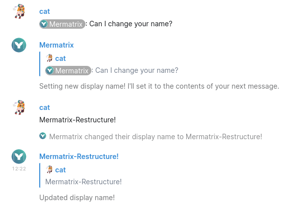

# Matrix-Botlerplate

&nbsp;

A simple but powerful boilerplate, to help you when creating Matrix bots using the [matrix-bot-sdk](https://github.com/turt2live/matrix-bot-sdk).

&nbsp;&nbsp;&nbsp;

&nbsp;

All of the following comes built-in:
- Multi-message commands
- Image sending with conversion to different formats
- Handling environment variables
- Generating an access token from username/password
- onMessage, a client.on('room.message') replacement that lets the client automatically detect edits, when it is mentioned, not reply to its own messages, etc.
- An example command that allows changing the bots display name & avatar from within the chat

## Built-in example command

There are also some commands you can use when @mentioning the bot!

| command |                  function                   |
| ------- | ------------------------------------------- |
| avatar  | Change the avatar of the bot account.       |
| name    | Change the display name of the bot account. |

You don't have to call them with any parameters!
After calling one of these commands, the next message you send will be used as input.

## Installing
- Clone the repository.
- Get an access token for your bot user (see [t2bot.io/docs/access_tokens/](https://t2bot.io/docs/access_tokens/)).
- Rename .env.example to .env and change the values.
- Run `npm install && npm build`.

|    npm run   |                   function                 |
| ------------ | ------------------------------------------ |
| start        | Run build/index.js                         |
| dev          | Run & watch app/index.ts                   |
| build        | Build app/ into build/                     |
| start-docker | Run the Dockerfile                         |
| dev-docker   | Build & run the Dockerfile                 |
| build-docker | Copy .env to .env.docker & build the image |

## Structure
- [app/](app/): Typescript code/src.
    - [@types/headless-mermaid](app/%40types/headless-mermaid/): type definition for the headless-mermaid api.
    - [commands/](app/commands/): the folder containing commands that can be used from the Matrix chat.
    - [utils/](app/utils/): functions used by the bot.
        - [client-setup](app/utils/client-setup.ts)
            1. Reads the .env file, either reading the access token or generating it from - and subsequently removing - the provided username/password.
            2. Sets up the Matrix client, including encryption, mixins, and the regex for when the bot is mentioned.
            3. Ties 1. & 2. together and returns the MatrixClient object.
            4. Additionally exposes onMessage, a function that can be used as an alternative to client.on('room.message'). Including automatic handling of multi message commands, returning extra variables like booleans about whether a message is an edit, and not responding to its own messages.
        - [env](app/utils/env.ts): (re)loads the .env file, and exposes getFromEnv, a function that returns environment variables but exits if undefined.
        - [globals](app/utils/globals.ts): defines globalThis types.
        - [logerror](app/utils/logerror.ts): exposes a simple function to be used with promises, e.g. `promise.then(()=>{...}).catch(logerror)`.
        - [multimessagecommands](app/utils/multimessagecommand.ts): adds support for multi message commmands. 
        - [sendImage](app/utils/sendImage.ts): exposes sendImage, a helper function that
            1. Automatically gets the image dimensions & size and sets it in the metadata.
            2. Converts the image to the passed mimetype.
            3. Uploads the image encrypted to Matrix.
            4. Easily allows the image to be used in a reply.
            5. In case of an SVG, generates a png thumbnail for increased compatibility.
    - [index](app/index.ts): runs the startClient from [client-setup](app/utils/client-setup.ts) and defines the commands to be run.
- [assets/](assets/): Images (and an image script) for use in the README.
- *build/*: Made during runtime. Compiled javascript code.
- *.env*: Manually made. Environment variables to use when running locally.
- *.env.docker* Manually made or generated from *.env*. Environment variables for use in Docker.

## Quirks
### SVG with a PNG preview
For one reason or the other, SVG's sent by the bot load forever.
As a workaround, a thumbnail/preview of the diagram gets rendered to PNG and attached to the message.

SVG's are really great. But also their implementation is weird. To give an example: Rocket.chat would preview SVG's on the desktop app and Chrome, but not on Firefox.

### USERNAME -> LOGINNAME
It seems weird to use this synonym for username while matrix tends to go for "username". Well, it turns out there is an environment variable on Windows called %USERNAME%, thus giving errors when this was run on Windows. Loginname it is!

### Why not a template repository?
Template repositories are also meant to be used when generating the repository, but updating from the template repository is roundabout at best, impossible at worst. I want the repositories forked from this to be able to work on their own and be customisable (hence I haven't turned it into an NPM module), but I also want the ability to add more functionality to the template and have that sync towards any bots created from here.

## License
This project is licensed under the [MIT License](LICENSE).

